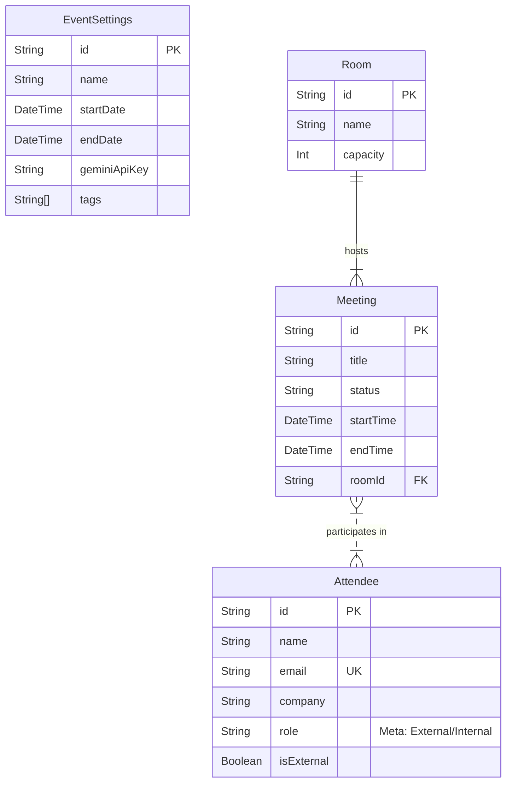

# Event Planner - Web Application Specification

**Version:** 1.0
**Date:** 2026-01-16
**Status:** Live / Active Development

---

## 1. Executive Summary

**Event Planner** is a comprehensive web application designed to streamline the management of corporate events, meetings, and attendee logistics. It serves as a central hub for event organizers ("Root" and "Admin" users) to schedule sessions, manage guest lists, and generate detailed reports, while providing a read-only interface for general "Users" to view schedules and attendee details.

Key value pillars include:
*   **Operational Efficiency**: Drag-and-drop scheduling and automated reporting.
*   **AI Augmentation**: Integrated AI chat for semantic search and operational assistance, plus AI-powered data entry.
*   **Data Integrity**: Robust role-based access control (RBAC) and automated backups.
*   **Real-time Insights**: Dashboard analytics for occupancy and meeting pipelines.

---

## 2. System Architecture

### 2.1 High-Level Design
The application follows a modern **Monolithic Architecture** built on the Next.js framework, utilizing Server-Side Rendering (SSR) and Server Components for performance and SEO, with Client Components for interactive UI elements.

### 2.2 Technology Stack

| Layer | Technology | Description |
| :--- | :--- | :--- |
| **Frontend Framework** | **Next.js 16** (App Router) | React server/client components, routing, and optimization. |
| **Language** | **TypeScript** | Static typing for reliability and maintainability. |
| **Styling** | **Tailwind CSS v4** | Utility-first CSS framework for responsive design. |
| **Database** | **PostgreSQL** | Relational database for structured data storage. |
| **ORM** | **Prisma** | Type-safe database client and schema management. |
| **Authentication** | **Clerk** | Identity management, authentication, and user metadata (Roles). |
| **AI / LLM** | **Google Gemini** | Generative AI for Chat Assistant and Auto-complete features. |
| **Monitoring** | **Sentry** | Error tracking and performance monitoring. |
| **Storage** | **Cloudflare R2** | Object storage for secure database backups. |
| **Infrastructure** | **Docker** | Containerization for consistent deployment environments. |

### 2.3 Key Integrations
1.  **Clerk**: Handles user sessions and protects routes. User roles (`metadata.role`) are essential for RBAC.
2.  **Sentry**: Captures runtime errors and performance metrics. Configured to track backend and frontend exceptions.
3.  **Google Gemini API**:
    *   **Chat Assistant**: RAG-lite capability (context-aware of event data) to answer queries.
    *   **Auto Complete**: Enriches attendee data (Bio, LinkedIn, Title) based on name and company.
4.  **GitHub Actions**: Automates database backups (`pg_dump` to R2) and CI workflows.

---

## 3. Data Architecture

### 3.1 Entity Relationship Diagram (ERD)

### 3.2 Key Models
*   **MeetingStatus**: Enum (`PIPELINE`, `CONFIRMED`, `OCCURRED`, `CANCELED`). Tracks the lifecycle of a meeting.
*   **EventSettings**: Singleton-like model storing global configurations (Event Name, Dates, API Keys).

---

## 4. User Personas & Access Control

The system implements strict **Role-Based Access Control (RBAC)** enforced via `middleware.ts` and API-level checks.

| Role | Description | Access Level |
| :--- | :--- | :--- |
| **Root** | System Owner / Super Admin | **Full Access**. Can manage System Settings, User Roles (`/admin/users`), Backups, and global Event configurations. |
| **Admin** | Event Manager | **Operational Access**. Can CRUD Meetings, Attendees, Rooms, and view Reports. *Cannot* manage Users or System Settings. |
| **User** | General Viewer | **Read-Only**. Can view Dashboard, Schedule, and Attendee lists. Cannot modify data. |

---

## 5. Feature Specifications

### 5.1 Meeting Tracker (Dashboard)
*   **Overview Stats**: Real-time counters for Attendees, Meetings, and Room Utilization.
*   **Briefing Book**: "One-click" generation of a PDF summary of all upcoming meetings.
*   **Search**: Global search filtering meetings by Title, Description, Room, or Attendee.

### 5.2 Schedule Management
*   **Interactive Calendar**: Drag-and-drop interface (`react-big-calendar`) for rescheduling.
*   **Meeting Lifecycle**: Users move meetings from *Pipeline* -> *Confirmed* -> *Occurred*.
*   **Conflict Detection**: (Future) Visual indicators for double-booked rooms.

### 5.3 Attendee Management
*   **Directory**: List view with sorting and filtering.
*   **AI Auto-Complete**:
    *   *Input*: Name + Company.
    *   *Process*: Gemini API searches web context.
    *   *Output*: Suggested Title, Bio, LinkedIn URL.
*   **Profiles**: Detailed view including meeting history for each attendee.

### 5.4 AI Chat Assistant
*   **Persistent Context**: Chat history is saved per session/user.
*   **Navigation Actions**: "Take me to settings" -> Generates a clickable navigation card.
*   **Context Awareness**: "Who is attending the Kickoff?" -> Queries database for specific meeting details.

### 5.5 Reports
*   **Pipeline Analysis**: Breakdown of meetings by status.
*   **Exports**: CSV and PDF export functionality for offline analysis.
*   **Filters**: Deep filtering by "Internal vs External" guests, Tags, and Meeting Types.

---

## 6. Security & Compliance

*   **Authentication**: All protected routes require a valid Clerk session. API routes verify `auth().protect()`.
*   **Authorization**: Middleware matcher prevents unauthorized role access to `/admin` and `/settings`.
*   **Data Protection**:
    *   Environment variables for secrets (`CLERK_SECRET_KEY`, `SENTRY_AUTH_TOKEN`).
    *   No hardcoded credentials.
*   **Backups**: Automated cron job (GitHub Action) dumps the Postgres database, encrypts/compresses it, and uploads to Cloudflare R2.
*   **Audit**: (Implicit) Sentry logs provide a trail of errors and system anomalies.

---

## 7. Infrastructure & Deployment

### 7.1 Development Environment
*   **Local**: `docker-compose.yml` spins up a PostgreSQL container.
*   **Run**: `npm run dev` starts the Next.js server on port 3000.
*   **Schema**: `prisma migrate dev` handles local schema changes.

### 7.2 Production (Deployment)
*   **Platform**: Deployment target is flexible (Vercel recommended for Next.js, or Docker-based VPS).
*   **Build**: `npm run build` generates optimized production assets.
*   **Environment**: Production secrets managed via platform environment variables.

---

**End of Specification**
